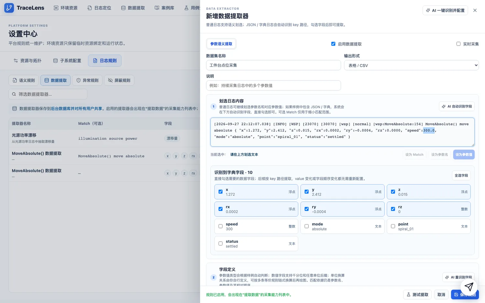
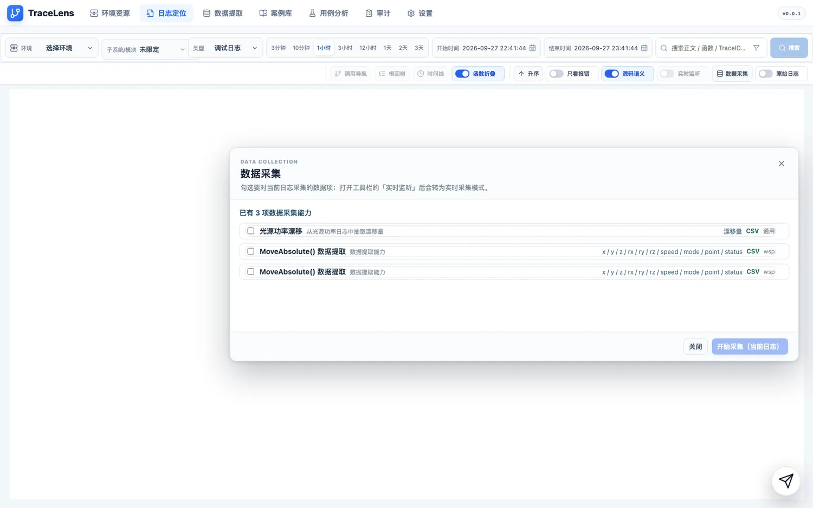
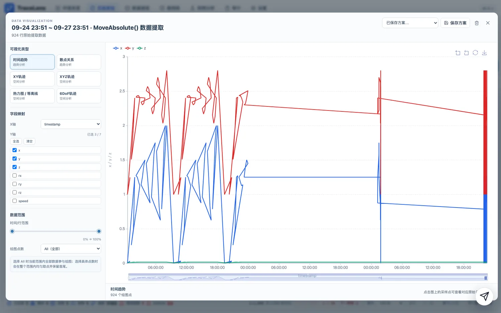
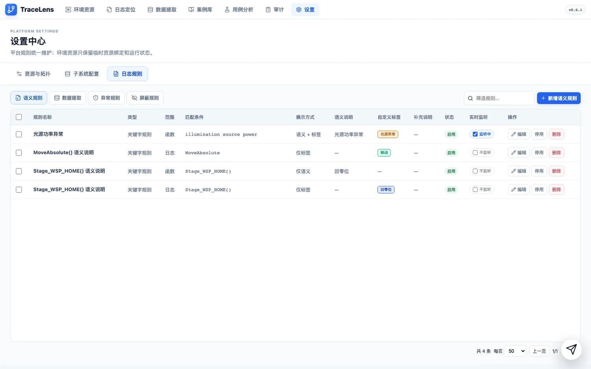
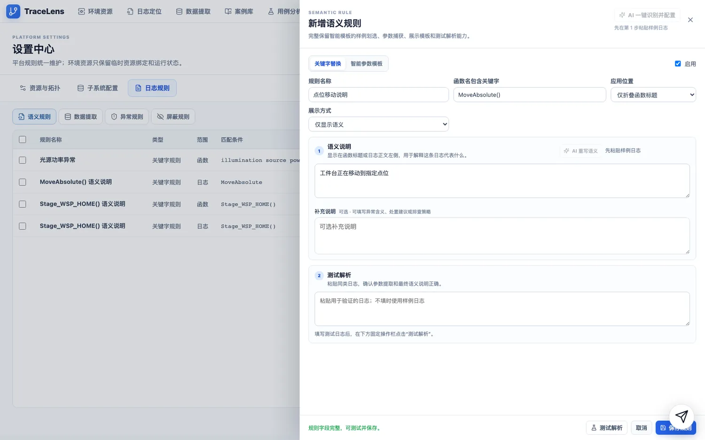

# TraceLens 使用说明书

> **把几万行机台日志折成一张张看得懂的调用卡片；再把日志里的数字，用一条规则采成能画图的表。**
>
> TraceLens 是面向机台现场排障的**日志可观测平台**。它做三件事：
> ① 让你**看懂**日志（按函数调用边界折叠、沿调用链导航、异常一眼可见）；
> ② 让你**取出**日志里的数据（一条提取规则 → 采集 → 画图 → 导出）；
> ③ 让你**沉淀**经验（语义规则把日志讲成人话、结论存成可复用案例、AI 助手替你跑完整条链路）。


---

## 目录

- [1. 亮点速览](#1-亮点速览)
- [2. 启动与打开](#2-启动与打开)
- [3. 五分钟上手](#3-五分钟上手)
- [4. 看懂日志：调用链折叠与导航](#4-看懂日志调用链折叠与导航)
- [5. 亮点一 · 日志提取：把日志里的数字变成表](#5-亮点一--日志提取把日志里的数字变成表)
- [6. 亮点二 · 语义规则：让日志说人话](#6-亮点二--语义规则让日志说人话)
- [7. 亮点三 · AI 助手 TracePilot](#7-亮点三--ai-助手-tracepilot)
- [8. 其余页面速览](#8-其余页面速览)
- [9. 接入自己的机台](#9-接入自己的机台)
- [10. 常见问题](#10-常见问题)
- [11. 目录结构与验证](#11-目录结构与验证)

---

## 1. 亮点速览

| 你的困扰 | TraceLens 怎么解决 | 看这里 |
| --- | --- | --- |
| 几万行日志滚到眼花，不知道哪段是哪段 | 按函数的**入口/出口边界**折叠成调用卡片，一次调用一张卡；同名重复自动合并成 `×N` | §4.1 |
| 报错在一瞬间，翻不到上下文 | **调用导航**：缩进树 + 流程地图，异常按颜色铺开 | §4.2 |
| 参数散在日志正文里，想画个趋势只能手抄 | **日志提取**：样例里划两下就生成提取规则，采集完直接出表、画图、导 CSV | §5 |
| 日志正文是天书（函数名 + 键值对） | **语义规则**：给关键字配一句人话，时间线右侧就显示「工件台正在移动到指定点位」 | §6 |
| 同类故障反复出现，每次都要重新判 | 结论沉淀成**案例**，人和 AI 都查得到 | §8 |
| 想让它自己干活 | **AI 助手**：说目标即可，它自己挑工具、自己切页面 | §7 |
| 想盯住正在跑的过程 | **实时监听**：勾一个模块，新日志像录音一样往后长 | §4.4 |

---

## 2. 启动与打开

```bash
bash scripts/sim.sh start     # 一键起全栈（服务 + 示例数据）
bash scripts/sim.sh status    # 看每个组件是否在跑
bash scripts/sim.sh stop      # 停
```

只想重启某一项：`bash scripts/sim.sh restart backend`。
其他子命令：`init`（重建示例数据）、`selftest`（自检）、`logs`、`hosts`。

打开浏览器访问前端地址（默认端口 `5173`）。顶部导航就是全部入口：

**环境资源 · 日志定位 · 数据提取 · 案例库 · 用例分析 · 审计 · 设置**，
右下角纸飞机是 AI 助手。

> ⚠️ **用主机地址访问，不要用回环地址（`localhost`）。** 如果这台机器上还跑着别的开发服务，
> 回环地址可能被它抢占，打开的是**另一个应用**。页面能打开 ≠ 打开的是本项目 —— 认一下页面标题。
> 同理，`status` 说「前端在跑」只代表那个端口有人监听。

> 💡 仓库自带一套**开箱可用的示例数据**（机台、日志树、报告、用例），
> 不需要真机台就能把下面每条流程走一遍。

---

## 3. 五分钟上手

1. 打开**环境资源**，确认要分析的环境在列表里。
   （没有就点右上角**添加环境**：填地址与账号 → **先点「测试连接」，通过了才能保存**。）
2. 点顶部**日志定位**。
3. **环境**：选一台。
4. **时间范围**：点一个够宽的窗口（例如 `1天` 或 `3天`）。
   🔴 预设里最窄的一档很窄，日志不在窗口里就会「搜不到」——先放宽再判断。
5. **子系统/模块**：展开一个子系统，勾上里面的模块。
   🔴 **至少勾一个**，空选会被拦下（提示「需至少勾选一个子系统/模块后再检索」）。
6. 点**搜索**，等几秒，时间线就长出来了 —— 每一行是一张**函数调用卡片**。

接下来按你的目的挑一条读：

- 想知道**这段流程哪里慢、哪里报错** → 第 4 节
- 想把**日志里的参数取出来画图** → 第 5 节
- 想让**日志显示成人话** → 第 6 节

---

## 4. 看懂日志：调用链折叠与导航

### 4.1 函数卡片怎么读（操作：什么都不用点，默认就是）

折叠后每张卡片是一行：

```
[时间] [组件] MeasureOverlay()                  [标签] [×N] [条数] [+]
```

- **函数名就是折叠依据**：入口行折叠出 `FuncName() >()`，出口行折叠出 `FuncName() <()`。
- **`×N`** = 同名重复调用被合并（点开是一组）。
- 卡片右侧是**标签**：`ERROR` / `WARN` 等异常级别、`用例语义`、`源码语义`，以及你自己配的自定义标签。
- 底栏是整体统计与分页，例如 `数据源 1 · 模块 1 · 进程 1 · 线程 1 · 函数 381 · 错误链路 1 · ERROR 28`。


> 图里左边是查询条件与工具栏，中间是折叠后的时间线，右侧是每张卡片的标签。

**工具栏开关**（一排按钮，随时切换）：

| 开关 | 作用 |
| --- | --- |
| **函数折叠** | 开：按函数边界折叠（默认，推荐）；关：逐行平铺 |
| **只看报错** | 只留命中异常规则的日志 |
| **升序 / 降序** | 时间排序 |
| **源码语义** | 是否在每行右侧显示语义说明与自定义标签 |
| **原始日志** | 切成逐行原文视图（见 4.3） |
| **实时监听** | 盯住一个模块持续接收新日志（见 4.4） |
| **数据采集** | 对当前日志跑数据提取（见第 5 节） |
| **调用导航 / 根因树 / 时间线** | 三种总览视图（见 4.2） |
| **案例 / 下载** | 把当前现场整理成案例草稿 / 导出 |

### 4.2 调用导航：缩进树与流程地图（操作：点工具栏【调用导航】）

左侧是**调用范围**（可按进程 / 函数 / 调用关系展开），右侧两种看法：

| 看法 | 什么时候用 |
| --- | --- |
| **缩进树** | 逐层核对某一条调用。左保留嵌套缩进、横轴按时间铺开，一眼看出「哪一段特别长」 |


| 看法 | 什么时候用 |
| --- | --- |
| **流程地图** | 一眼看完整流程哪里不对。按标签/异常着色（如 `异常 107 · 警告 52 · 正常 224`），可缩放、可拖动 |


### 4.3 原始日志（操作：拨开工具栏【原始日志】开关）

用来核对「日志本身长什么样」。行格式（真实机台与示例数据一致）：

```
[时间] [级别] [组件] [pid] [tid] [模块] [场景] [文件:函数:行] 函数名() 正文
```


### 4.4 实时监听（操作：拨开【实时监听】，再勾模块）

勾一个模块，前端通过 SSH `tail -F` + SSE 持续接收新日志，时间线像「录音」一样往后长。

> ⚠️ **第一行要等十几秒**：远端 `tail -F` 的 stdout 是管道、全缓冲，要攒够约 4KB 才输出 ——
> 这是固有的，不是卡住了。
>
> ⚠️ 开着实时监听时，工具栏的「数据采集」会切换成**实时采集**模式（见 5.2）。

---

## 5. 亮点一 · 日志提取：把日志里的数字变成表

一句话：**在一条真实日志上划两下，就得到一条提取规则；之后无论采哪段时间的日志，都能一键出表、画图、导 CSV。**

两件事分开管，别混淆：

- **规则**（数据提取器）—— 描述「取哪些字段」，存在**设置 → 日志规则 → 数据提取**里，对所有人生效；
- **记录**（提取记录）—— 一次采集的凭证，存在**数据提取**页，可重放、可还原。

### 5.1 第一步：新建一条数据提取规则

**操作路径：设置 → 日志规则 → 数据提取 → 新增数据提取器**

1. **数据集名称**：起个能认出来的名字（例如「工件台点位采集」），**输出形式**选「表格 / CSV」。
2. **划选日志内容**：把一条**真实日志**整行粘进样例框。
   - 如果样例里含 **JSON / 字典**，系统会立刻扫出全部字段（图里的「识别到字典字段 · 10」），**直接勾选**要采集的那几个即可；
   - 如果是**普通文本日志**，直接在样例里**划选参数名 / 参数值**，再点「设为参数名」「设为参数值」；
   - 也可以点「AI 自动识别字段」，让 AI 替你划。
3. **字段定义**：核对字段类型；需要换算单位时在这里加换算规则（数值字段支持千分位与任意单位后缀）。
4. **作用范围**：建议限定到具体**子系统 / 模块**（留空等于全部，会拖慢每行的检查）；也可以点「AI 识别范围」。
5. **测试提取**：拿上面的样例验一次，确认取到的值对。
6. **保存规则**。



> 图里：样例框中 `"speed":300.0` 是划选出来的值；下方「识别到字典字段 · 10」已勾选六个自由度；
> 右上角「AI 一键识别并配置」可以在粘好样例后一次填完整份配置。

### 5.2 第二步：采集（操作：日志页工具栏 →【数据采集】）

**入口在日志页**：先按第 3 节搜出一批日志，再点工具栏的**数据采集**。

1. 弹窗里会列出**当前可用的采集能力**（就是上一步建好的规则）—— 勾选你要的那几项。
   每项后面标着它的字段、输出格式与作用范围。
2. 点**开始采集（当前日志）**，按时间分片跑，进度实时显示。
   - 要边跑边采新的日志，先把工具栏**实时监听**打开，此时按钮变成**开始采集（实时采集）**。
3. 跑完在同一个弹窗里看结果：**查看 / 绘图 / 单独下载**；
   勾选多项还可以**合并下载 CSV**（按时间线合并、字段取并集）。



> 采集弹窗是**非模态**的：采集期间日志页照常能看、能滚动。

### 5.3 第三步：出图与导出（操作：结果行点【绘图】）



图里有：**可视化类型**（时间趋势 / 散点关系 / XY 轨迹 / XYZ 轨迹 / 热力图·等高线 / 6DoF 轨迹）、
**字段映射**（选哪个字段当 X 轴、哪几个当系列）、**数据范围**与**绘图点数**滑块，
右上角可以把当前配置**保存方案**，下次一键复用。

导出：单条结果直接下载；多条可合并成一份 CSV。

### 5.4 提取记录：随时「还原」


**数据提取**页保存的是**提取过程与可重放快照**，不是数据本身 —— 数据在你需要时由浏览器重新还原
（省磁盘，也保证和当时的查询条件对得上）。

- 一条记录 = 一次提取：哪个环境、原日志的哪个时间范围、用的哪条规则、上次命中多少行。
- 每行可 **还原 / 查看 / 可视化 / 下载 / 原日志**。
  > 只有**还原过**（或刚采集完）的行才能查看/绘图/下载 —— 数据没在浏览器里时按钮是灰的。
- 顶部三个数字一眼看全局：提取记录条数、上次命中行数、当前浏览器可直接下载的条数。

---

## 6. 亮点二 · 语义规则：让日志说人话

日志正文里通常是这样的：

```
MoveAbsolute() move absolute { "x":1.272, "y":2.412, ... "status":"settled" }
```

**语义规则**就是给这类日志配一句人话，让时间线右侧直接显示「工件台正在移动到指定点位」，
不必每次都去读键值对。

### 6.1 规则列表（操作：设置 → 日志规则 → 语义规则）



每行一条规则，列含义：**规则名称 · 类型 · 范围（函数 / 日志）· 匹配条件 · 展示方式 ·
语义说明 · 自定义标签 · 补充说明 · 状态 · 实时监听**。
右侧可**编辑 / 停用 / 删除**；表头还能搜索、批量启用停用删除。

> **「实时监听」这一列**：勾上表示这条规则对实时流入的日志也生效（适合盯现场）。

### 6.2 新增一条语义规则（操作：右上角【新增语义规则】）

1. **规则名称**：起个名字。
2. **函数名包含关键字**：填日志里那个函数名（例如 `MoveAbsolute()`）——
   这条规则就只作用在这个函数上。
3. **应用位置 / 展示方式**：决定这句语义显示在哪、要不要同时挂一个标签。
4. **语义说明**：写那句人话。
5. **补充说明**：可选，写异常含义、处置建议或排查策略。
6. 先点**测试解析**验一下，再**保存规则**。



> 编辑器里有两个 AI 帮手：右上角「AI 一键识别并配置」粘好样例后一次填完整份配置；
> 「语义说明」旁「AI 重写语义」可以把生硬的文字改得更像现场用语。
> 底部状态栏会提示「规则字段完整，可测试并保存。」

### 6.3 同一页还有三类规则

| 页签 | 解决什么 |
| --- | --- |
| **异常规则** | 定义哪些关键字算异常（决定「只看报错」和异常标签认什么） |
| **屏蔽规则** | 把重复心跳、轮询这类噪音从视图里去掉（关键字 / 函数名 / 正则 / 智能模板，`{*}` 表示可变语段） |
| **折叠规则** | 为**非标准格式**的日志自建入口/出口配对关键字（默认的 `>()` / `<()` 规则继续独立生效） |
| **自定义标签** | 语义色 + 符号 + 样式（柔和 / 实心 / 描边），把重要日志标出来 |

> 配置里引用占位符必须指向真实存在的参数，否则保存时会被校验拦下。

---

## 7. 亮点三 · AI 助手 TracePilot

右下角纸飞机打开 **TracePilot**。


**它和页面共用同一套「原子能力」**（清单见：设置旁的**能力中心**）：读日志、查目录、查环境、
跑用例诊断、以及一大票**前端动作** —— 切页面、改日志视图、开关折叠与标签、建规则、跑数据采集。
所以它做的事，你手动也能做；它只是替你串起来。

打开时会给几条基于**当前上下文**的建议，例如：

- 分析当前已展示的这批日志
- 统计各接口耗时并找出慢调用
- 定位当前这批 ERROR 的原因

**用法要点**

- 直接说目标即可（「这条 ERROR 的根因是什么」「帮我把这批点位日志提取成表」），不用背命令。
- **需要你做决定时，AI 会给可点的选项按钮**，点一下就等于把答案发回去。
- AI 代你操作页面时会进入**托管**状态：整页呼吸绿框 + 「页面正在被托管」，结束后自动回弹。
- 输入中文选词时按回车**不会**误发送。

---

## 8. 其余页面速览

### 8.1 环境资源


卡片 / 树两种形态、收藏星标、文件夹分组、部署进度与「一键停启进程」、批量刷新与删除。
**新增环境必须先「测试连接」通过才能保存**。从这里可以直达该环境的日志定位与测校报告。

### 8.2 用例分析


粘贴用例/报告链接（或拖 Excel 进来，多个 Excel 各自保留 Tab）。
报告页**先结论后原文**：结论卡片 → 异常速览（可点）→ 文件页签 → 全宽日志查看器（点异常直接定位到行）。
一次 AI 诊断的回答本身就是一份**案例草稿**，不用再二次整理。

### 8.3 测校报告


从环境资源进入。可按子系统/模块与报告类别过滤，报告**在线渲染**（不必下载），
并与数据表**成对**关联（缺一对会提示「孤儿」）。

### 8.4 案例库


把「这类故障是怎么判出来的」沉淀成**可复用案例**，人和 AI 都查得到：

- 列：`状态 | 案例名称 | 分类 | 故障现象 | 模块/特征 | 现场特征 | 更新时间 | 操作`。
- 可按 `全部 / 启用 / 停用` 过滤，也能按案例名 / 模块 / 错误码 / 根因搜索。
- 每条案例带**证据**，可特征 / 编辑 / 删除。
- 左上角**AI 诊断**：让 TracePilot 基于案例库直接给判定。
- 从用例分析做完 AI 诊断后，那份结论就是案例草稿，可直接存进来。

### 8.5 操作审计


**功能级留痕**：你点出来的每个功能一条记录 ——
`操作时间 | 功能（+分组） | 操作记录 | 用户/来源 IP | 结果 | 耗时 | 详情`。
系统的自动轮询与流式请求**不记录**，所以这里看到的都是「真有人操作」。
另一个页签「日志检索审计」是检索侧诊断（检索范围、命中文件、重试次数）。

### 8.6 设置中心


| 页签 | 管什么 |
| --- | --- |
| **资源与拓扑** | 机台拓扑相关路径、下位机登录用户与 SSH 端口，以及**日志类型与根目录模板**（每种日志类型的标识、启用的机器范围、根目录模板、文件匹配规则） |
| **子系统配置** | 子系统 / 模块 / 日志类型的目录登记 |
| **日志规则** | 语义规则、数据提取、异常规则、屏蔽规则、折叠规则、自定义标签（见第 6 节） |

路径模板支持 `{username}` `{machine_ip}` `{upper_machine_ip}` `{lower_machine_ip}` `{subsystem}` `{module}`。

### 8.7 能力中心


TracePilot 与页面操作**共用同一套原子能力注册表**，这里能看到全部清单与可用状态；
每条能力都有中文名、说明和所属领域标签，可按领域或关键字筛选。

---

## 9. 接入自己的机台

1. **设置 → 资源与拓扑**：填好机台拓扑相关路径、下位机登录用户与 SSH 端口，保存。
2. **设置 → 资源与拓扑 → 日志类型与根目录模板**：确认每种日志类型的**根目录模板**与
   **文件匹配规则**能对上你的真实目录（模板参数见 8.6）。
3. **环境资源 → 新增环境**：填上位机 / 下位机地址与账号，**先点「测试连接」，通过了才能保存**。
4. 到**日志定位**搜一批日志出来，回**设置 → 日志规则**调语义 / 标签 / 折叠规则，按需建数据提取器。

**日志内容的约定**（想要折叠、标签、数据提取都正常，日志得按这个写）：

| 约定 | 说明 |
| --- | --- |
| 行格式 | `[时间] [级别] [组件] [pid] [tid] [模块] [场景] [文件:函数:行] 正文` |
| 函数名要写**调用形状** | 入口 `FuncName() >() enter … start …`、出口 `FuncName() <() leave … end …`、正文 `FuncName() …`。写成 `[FuncName] >()` 会让两条内置折叠规则**静默失效** |
| 正文里的字典要**合法 JSON** | 键与字符串值带双引号、末项无尾随逗号：`{ "x":1.250, "point":"spiral_10", "status":"settled" }`。无引号或单引号写法都过不了 `json.loads` |
| 正文用英文 | 真实机台日志没有中文 |

---

## 10. 常见问题

**搜不到日志 / 时间线是空的**
① 先把**时间范围放宽**（预设最窄那档很窄，日志不在窗口里就搜不到）。
② 确认**子系统/模块至少勾了一个**，否则会被「禁止空选全量检索」拦下。
③ 若提示「没有可折叠的调用日志」，说明**搜到了但没折出调用链** —— 关掉**函数折叠**看逐行，
或检查日志里函数名有没有写成 `FuncName()` 的形状。

**打开地址后是别的应用**
回环地址被同机的其他开发服务占了。换成主机地址访问（见第 2 节）。

**实时监听半天不出第一行**
远端 `tail -F` 的管道要攒够约 4KB 才输出，首行延迟十几秒是正常的。

**「只有出口没有入口」/ 调用链对不上**
小日志文件是**倒序读取**（新→旧），所以出口行会先出现。诊断时**先按时间戳排序**再判断配对。

**数据提取页里查看 / 绘图 / 下载是灰的**
数据不在浏览器里。先点那一行的**还原**，还原完成后再操作（见 5.4）。

**日志时间戳看着很假（整秒 / 像上一代的数据）**
后端有两层缓存，重建数据后都要清；`sim.sh init` / `seed` 会自动清，手动重建数据后记得也走一次。

---

## 11. 目录结构与验证

```
backend/            Django 后端（apps/ 业务、simremote/ 示例数据与假机群、tests/）
frontend/           Vite + React 前端（src/parser 日志解析、src/rendering 呈现、src/components 页面）
scripts/sim.sh      唯一启动入口（start / stop / restart / status / init / selftest / deploy / logs）
docs/screenshots/   本说明书里的截图
AGENTS.md           给 AI / 开发会话的入场须知（改代码前先读）
```

```bash
cd frontend && npx tsc -b                        # 类型检查
cd frontend && npm run build                     # 生产构建
bash scripts/sim.sh selftest                     # 数据 / 日志格式 / 部署互信 全量自检

# 后端单测：比对失败集合有没有变大即可
backend/.venv/bin/python -m pytest backend/tests/ -q \
  --ignore=backend/tests/test_v11_workspace_cors_version_static.py
```

> 仓库是**多会话并行**开发的：提交时请显式 `git add <路径>`，别用 `git add -A`。

---

<sub>说明书里的截图都是在真实界面上**真开浏览器、真点、真搜**抓下来的（1600×1000 → WebP）。</sub>
