# TraceLens 使用说明书

> **在对话框里说一句需求，AI 自己决定去看哪些日志、并顺势把界面切到你需要的样子。**
>
> TraceLens 是面向机台现场排障的**日志可观测平台**：一边把上/下位机的海量日志摊成可折叠、可导航、
> 可打标签的时间线，一边让 AI 助手（TracePilot）按你的目标去读日志、查知识库、跑用例诊断、部署环境，
> 甚至直接替你改界面。

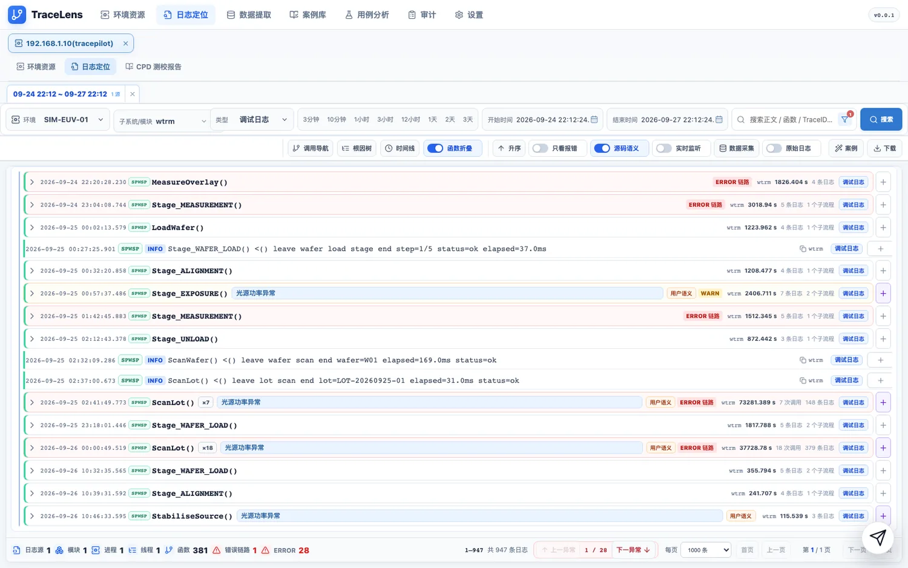

---

## 目录

- [1. 这是什么](#1-这是什么)
- [2. 启动与访问](#2-启动与访问)
- [3. 五分钟上手](#3-五分钟上手)
- [4. 日志定位（主战场）](#4-日志定位主战场)
- [5. AI 助手 TracePilot](#5-ai-助手-tracepilot)
- [6. 其余页面](#6-其余页面)
- [7. 接入自己的机台](#7-接入自己的机台)
- [8. 常见问题](#8-常见问题)
- [9. 目录结构与验证](#9-目录结构与验证)

---

## 1. 这是什么

| 层 | 位置 | 干什么 |
| --- | --- | --- |
| 前端 | `frontend/`（Vite + React 18 + TS，默认 5173） | 页面、时间线与折叠呈现、AI 助手面板 |
| 后端 | `backend/`（Django 6 + DRF + SQLite + Redis，ASGI，默认 8000） | 日志检索与缓存、环境/机器、数据提取、用例库、AI 工具 |
| 仿真环境 | `backend/simremote/` + `scripts/sim.sh` | 假 SSH 机群、仿真日志、CPD 报告站、实时日志流 |

**你能用它做四件事**

1. **定位日志** —— 选环境 + 时间窗，把几万行日志折叠成"一次调用一张卡片"，顺着调用链找异常。
2. **提取数据** —— 从日志正文里按规则抽出结构化数据（如工件台六自由度点位），可预览、可下载、可回放。
3. **分析用例** —— 把 ATLog 的失败用例报告拉进来，一键 AI 诊断，结论直接沉淀成案例。
4. **让 AI 干活** —— 在对话框里说目标，TracePilot 自己挑工具、自己切页面。

---

## 2. 启动与访问

```bash
bash scripts/sim.sh start     # 全栈：Redis / 仿真资产 / 假机群 / 报告站 / 实时日志源 / 后端 / 前端
bash scripts/sim.sh status    # 看每个组件与模拟机群的运行状态
bash scripts/sim.sh stop      # 停
```

只想重启后端：`bash scripts/sim.sh restart backend`。
其他可用子命令：`init`（重建仿真资产）、`realign`、`deploy`（上下位机 SSH 互信）、`selftest`（自检）、`logs`、`hosts`。

| 入口 | 地址 |
| --- | --- |
| **主界面** | `http://<本机网卡 IP>:5173/?env=2` |
| 后端 API | `http://127.0.0.1:8000/api/` |
| 仿真报告站（ATLog / CPD） | `http://127.0.0.1:8901/`，CPD 在 `/cpd/` |

> ⚠️ **主界面请用网卡 IP，不要用 `127.0.0.1:5173`。**
> 前端 Vite 绑的是 `0.0.0.0:5173`，而 `127.0.0.1:5173` 很可能被**别的项目**占着 ——
> 本机实测另一个项目的 dev server 抢了它，访问过去打开的是**另一个应用**。
> 用网卡地址（本机是 `192.168.1.10`）一定对得上。
> 顺带一提：`sim.sh status` 显示「Vite 运行中」只代表**那个端口有人监听**，不代表监听的是 TraceLens。

**内置的仿真环境**（拿来练手用，不需要真机台）

| 项 | 值 |
| --- | --- |
| 环境 | `SIM-EUV-01`（环境 **id = 2**，所以 URL 里写 `env=2`） |
| 上位机 | `SIM-SCH-01` — `192.168.1.10:2222` |
| 下位机 | `SIM-LCH1-01` — `192.168.1.10:2223` |
| 账号 | 登录用户 `tracepilot` |
| 软件版本 | `SPM-V2026.09.23` |

---

## 3. 五分钟上手

1. 打开 `http://<网卡 IP>:5173/?env=2`，顶部导航停在**环境资源**，能看到 `SIM-EUV-01` 卡片。
2. 点顶部**日志定位**。
3. **环境**下拉 → `SIM-EUV-01`。
4. **时间范围**点 `3天`。（预设里最窄是 3 分钟，而仿真资产的时间锚点可能是几天前 —— 窗口太窄会搜不到东西。）
5. **子系统/模块** → 展开 `spwsp` → 勾上里面的模块。
   🔴 **这一步不能跳过**：空着会被拦下来，提示「当前日志类型需至少勾选一个子系统/模块后再检索，禁止空选全量检索」。
6. 点**搜索**。等几秒，时间线就长出来了 —— 每一行是一张**函数调用卡片**，可以逐层展开。

---

## 4. 日志定位（主战场）

### 4.1 查询条件

| 控件 | 说明 |
| --- | --- |
| **环境** | 选一台环境资源；也可以不选环境、改用「导入日志」（本地文件或粘贴文本）建独立分析任务 |
| **子系统/模块** | 可多选；**至少勾一个**才能检索 |
| **类型** | 调试日志 / 运行日志 / 执行器日志等，来自「设置 → 资源与拓扑」里启用的类型 |
| **3分钟 … 3天** | 相对当前时间的快捷时间窗 |
| **开始时间 / 结束时间** | 也可以手填，支持粘贴完整时间戳 |
| **搜索框** | 在结果里做全文 / 函数名过滤 |
| **搜索** | 发起检索（走 SSH 读远端日志，经缓存后返回） |

### 4.2 工具栏开关

- **调用导航** —— 打开调用链导航窗口（见 4.3）
- **根因树** —— 按当前时间范围直接读运行日志 `event.log`，出事件根因树
- **时间线** —— 模块 / 进程 / Trace 的时间分布总览
- **函数折叠** —— 开：按函数边界折叠（推荐）；关：逐行平铺
- **只看报错** —— 只留命中异常规则的日志
- **升序 / 降序** —— 时间排序
- **源码语义 / 语义说明** —— 是否在每行右侧显示语义说明与自定义标签
- **实时监听** —— 盯住**一个**模块，用 SSH `tail -F` 持续推送新增日志（见 4.5）
- **数据采集** —— 对当前日志跑数据提取（见 6.2）
- **原始日志** —— 切成逐行原文视图（见 4.4）
- **案例** —— 把当前现场整理成案例草稿
- **下载** —— 导出

### 4.3 函数卡片怎么读

折叠后的每张卡片是一行 36px：

```
[时间] [组件] MeasureOverlay()                    [标签] [×N] [条数] [+]
```

- **函数名**就是折叠依据：卡片展开后会还原成入口行的形态 —— 按 `>()` 折的显示 `FuncName() >()`，
  按 `<()` 折的显示 `FuncName() <()`。
- **`×N`** = 同名重复调用被合并（点开是一组）。
- 卡片右侧是**标签**：`ERROR` / `WARN` 等异常级别、`用例语义`、`源码语义`，以及你自己配的自定义标签。
- 底栏是整体统计与分页：`数据源 1 · 模块 1 · 进程 1 · 线程 1 · 函数 381 · 错误链路 1 · ERROR 28`。

### 4.4 调用导航：缩进树与流程地图

点**调用导航**打开，左侧是**调用范围**（按进程 / 函数 / 调用关系展开），右侧两种看法：

| 看法 | 适合 |
| --- | --- |
| **缩进树** | 逐层核对某一条调用：左侧保持嵌套缩进，横轴按时间铺开，一眼看到"哪一段特别长" |

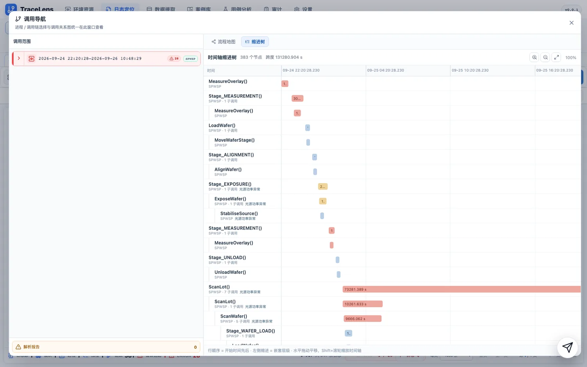

| 看法 | 适合 |
| --- | --- |
| **流程地图** | 一眼看完整流程哪里不对：按标签和异常着色（如 `异常 107 · 警告 52 · 正常 224`），可缩放、可拖动 |

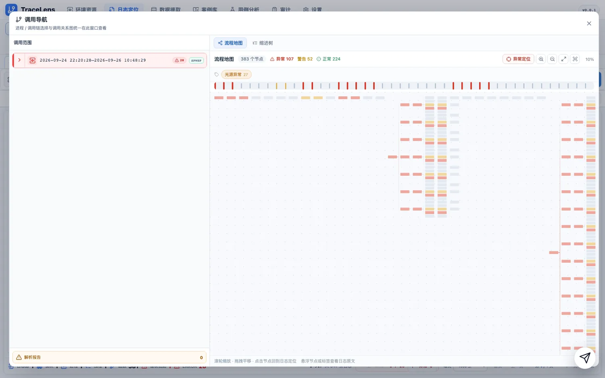

### 4.5 原始日志与实时监听

**原始日志**切到逐行原文，用来核对"日志本身长什么样"：

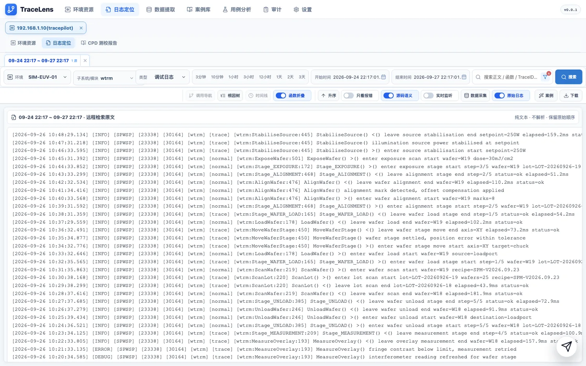

行格式是（真实机台与仿真器一致）：

```
[时间] [级别] [组件] [pid] [tid] [模块] [场景] [文件:函数:行] 函数名() 正文
```

**实时监听**：勾一个模块，前端通过 SSH `tail -F` + SSE 持续接收新日志，时间线像"录音"一样往后长。
⚠️ **第一行要等十几秒**：远端 `tail -F` 的 stdout 是管道，全缓冲，要攒够约 4KB 才 flush —— 这是固有的，不是卡住了。

---

## 5. AI 助手 TracePilot

右下角的纸飞机按钮打开 **TracePilot**：

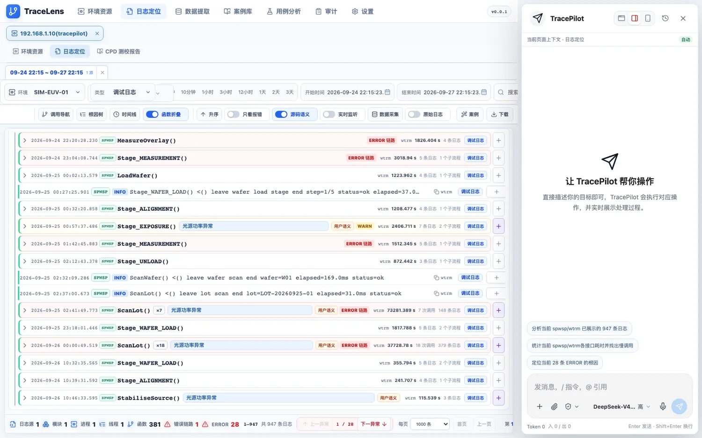

**它和页面共用一套"原子能力"**（见 6.8 能力中心）：读日志、查目录、查环境、跑用例诊断、部署环境、
以及一大票**前端动作**（切页面、改日志视图、开关折叠与标签、建规则、跑数据采集）。

打开时会给几条基于当前上下文的建议，例如：

- 分析当前 `spwsp/wtrm` 已展示的 947 条日志
- 统计当前 `spwsp/wtrm` 各接口耗时并找出慢调用
- 定位当前 28 条 ERROR 的原因

**用法要点**

- 直接说目标即可（"这条 ERROR 的根因是什么"、"帮我把 wtrm 的点位日志提取成表"），不用背命令。
- **需要你做决定时，AI 会给可点的选项按钮**，点一下就等于把答案发回去，不用手打。
- AI 代你操作页面时会进入**托管**状态：整页呼吸绿框 + 「页面正在被托管」，结束后自动回弹。
- 输入中文选词时按回车**不会**误发送。

---

## 6. 其余页面

### 6.1 环境资源

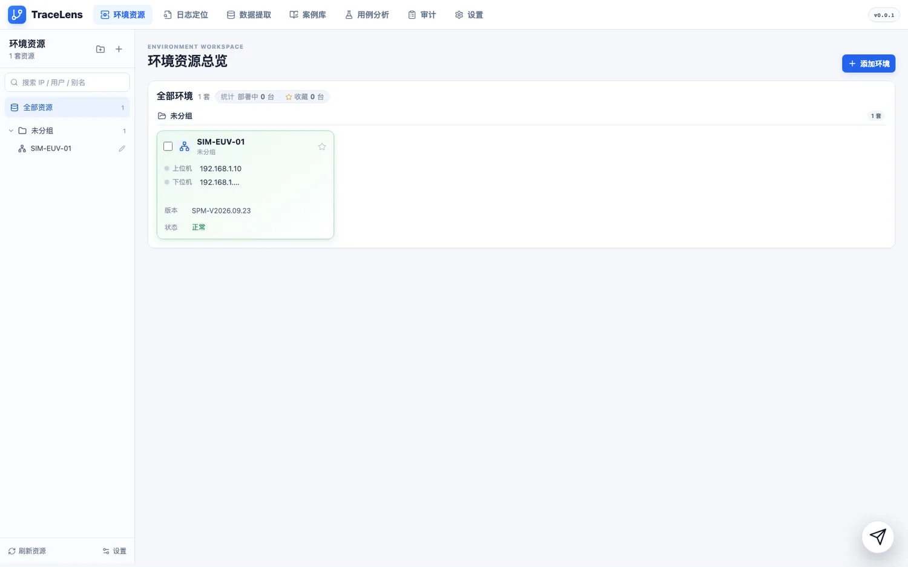

卡片 / 树两种形态、收藏星标、文件夹分组、部署进度与"一键停启进程"、批量刷新与删除。
**新增环境必须先「测试连接」通过才能保存**。从这里可以直达该环境的日志定位与 CPD 测校报告。

### 6.2 数据提取

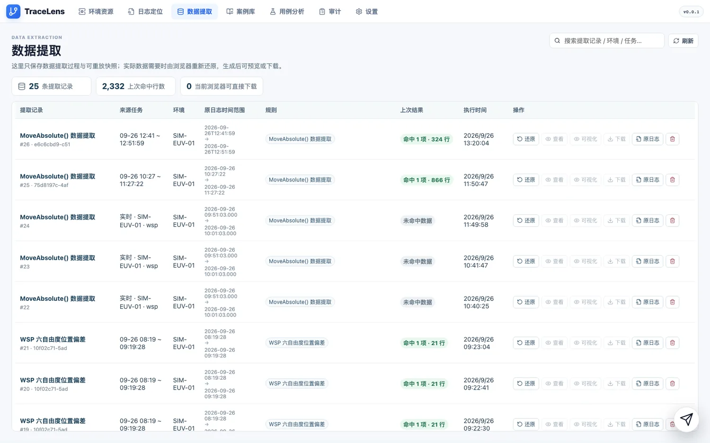

这里保存的是**提取过程与可重放快照**，数据本身需要时再由浏览器重新还原：

- 一条记录 = 一次提取（哪个环境、原日志时间范围、用的哪条规则、上次命中多少行）。
- 每行可 **还原 / 查看 / 可视化 / 下载 / 看原日志**。
- 规则编辑器支持**语义划选**（普通日志）和 **JSON/字典 key 路径自动识别**，
  还能**让 AI 从样例日志一键填好整份配置**。
- 从日志页的「数据采集」发起时，采集弹窗是**非模态**的：采集期间照样能看日志。

### 6.3 用例分析

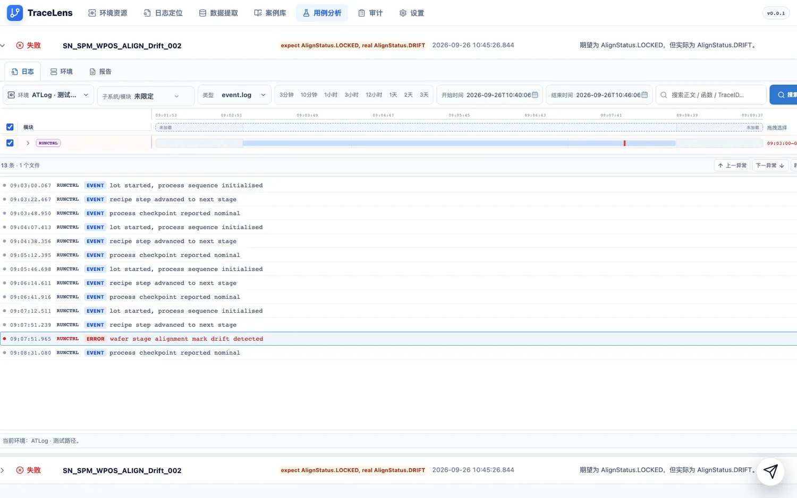

粘贴 ATLog 用例/报告链接（或拖 Excel 进来，多个 Excel 会各自保留 Tab）。报告页**先结论后原文**：
结论卡片 → 异常速览（可点）→ 文件页签 → 全宽日志查看器（点异常直接定位到行）。
一次 AI 诊断的回答就是一份**案例草稿**，不用再二次整理。

### 6.4 CPD 测校报告

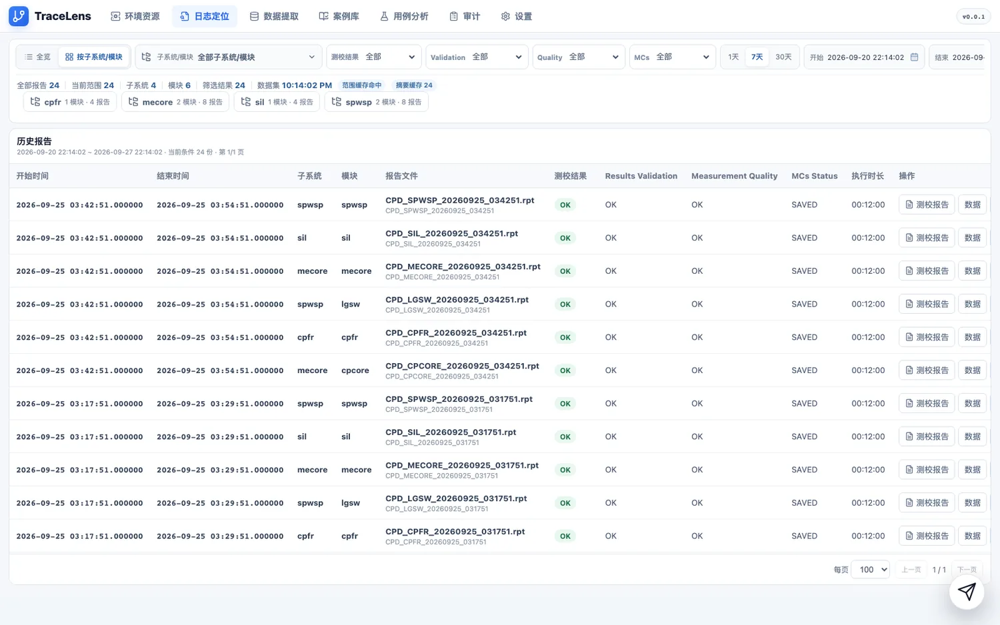

从环境资源进入。可按子系统/模块与 `测校结果 / Validation / Quality / MCs` 过滤，
`.rpt` 报告**在线渲染**（不必下载），并与 `cpd/data` 下的数据表**成对**关联（缺一对会报"孤儿"）。

### 6.5 案例库

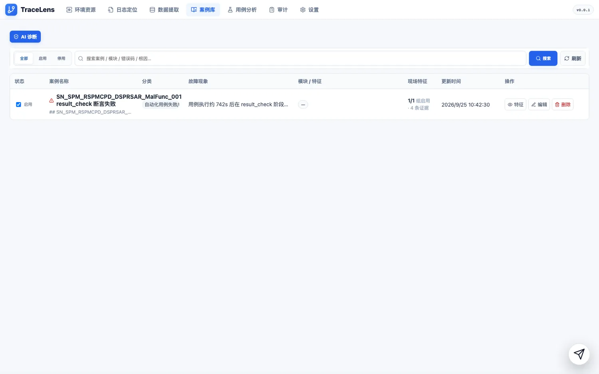

把"这类故障是怎么判出来的"沉淀成**可复用案例**，人和 AI 都查得到：

- 表格列：`状态 | 案例名称 | 分类 | 故障现象 | 模块/特征 | 现场特征 | 更新时间 | 操作`。
- 可按 `全部 / 启用 / 停用` 过滤，也能按案例名 / 模块 / 错误码 / 根因搜索。
- 每条案例带**证据**（本机示例：`1/1 组启用 · 4 条证据`），可**特征 / 编辑 / 删除**。
- 左上角**AI 诊断**：让 TracePilot 基于案例库直接给出判定。
- 从用例分析里做完一次 AI 诊断后，那份结论就是案例草稿，可直接存进来。

### 6.6 操作审计

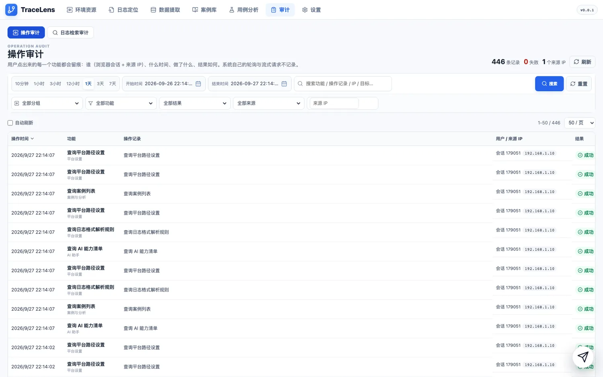

**功能级留痕**：你点出来的每个功能一条记录 —— `操作时间 | 功能（+分组） | 操作记录 | 用户/来源 IP | 结果 | 耗时 | 详情`。
系统的自动轮询与流式请求**不记录**，所以这里看到的都是"真有人操作"。
本工具目前没有登录体系，所以"用户"列通常是空的，用**浏览器会话 + 来源 IP**区分操作者。
另一个页签「日志检索审计」是检索侧诊断（检索范围、命中文件、重试次数）。

### 6.7 设置中心

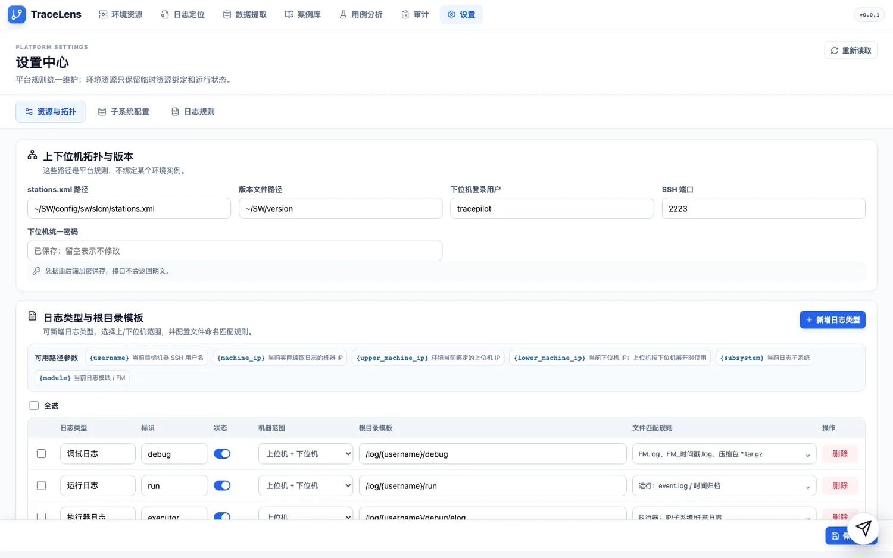

三个页签：

- **资源与拓扑** —— `stations.xml` 路径、版本文件路径、下位机登录用户/SSH 端口/密码，
  以及**日志类型与根目录模板**（每种日志类型的标识、启用的机器范围、根目录模板、文件匹配规则）。
  路径模板支持 `{username}` `{machine_ip}` `{upper_machine_ip}` `{lower_machine_ip}` `{subsystem}` `{module}`。
- **子系统配置** —— 子系统 / 模块 / 日志类型的目录登记。
- **日志规则** —— 三类规则：**日志语义规则**、**自定义标签**（16 档语义色 + 符号 + 柔和/实心/描边三种样式）、
  **折叠规则**。占位符要引用真实存在的参数，否则会被校验拦下。

### 6.8 能力中心

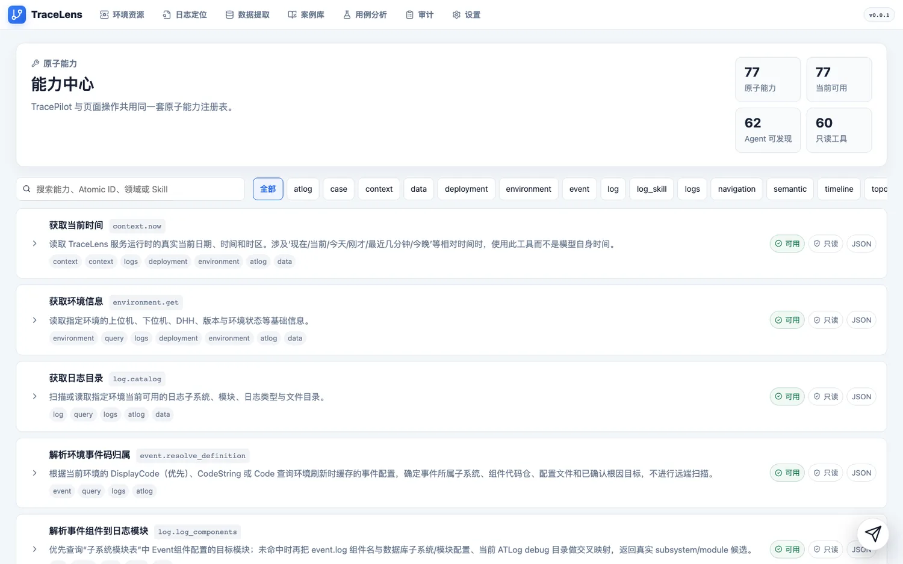

TracePilot 与页面操作**共用同一套原子能力注册表**，这里能看到全部清单与可用状态
（本机实测：77 个原子能力、77 个当前可用、62 个 Agent 可发现、60 个只读工具），
每条能力都有中文名、说明和所属领域标签，可按领域或关键字筛选。

---

## 7. 接入自己的机台

1. **设置 → 资源与拓扑**：填好 `stations.xml` / 版本文件路径 / 下位机登录用户与 SSH 端口，保存。
2. **设置 → 资源与拓扑 → 日志类型与根目录模板**：确认每种日志类型的根目录模板与文件匹配规则
   能对上你的真实目录（模板参数见 6.7）。
3. **环境资源 → 新增环境**：填上位机 / 下位机地址与账号，**先点「测试连接」，通过了才能保存**。
4. 到**日志定位**选这台环境、勾子系统/模块、搜一批日志，回**设置 → 日志规则**调语义/标签/折叠规则。

**日志内容的约定**（想要折叠、标签、数据提取都正常，日志得按这个写）：

| 约定 | 说明 |
| --- | --- |
| 行格式 | `[时间] [级别] [组件] [pid] [tid] [模块] [场景] [文件:函数:行] 正文` |
| 函数名要写**调用形状** | 入口 `FuncName() >() enter … start …`、出口 `FuncName() <() leave … end …`、正文 `FuncName() …`。写成 `[FuncName] >()` 会让两条内置折叠规则**静默失效** |
| 正文里的字典要**合法 JSON** | 键与字符串值带双引号、末项无尾随逗号：`move absolute { "x":1.250, "point":"spiral_10", "status":"settled" }`。无引号或 Python 单引号写法都过不了 `json.loads` |
| 正文用英文 | 真实机台日志没有中文 |

---

## 8. 常见问题

**搜不到日志 / 时间线是空的**
① 先把时间窗放宽（预设最窄 3 分钟，仿真资产可能在几天前 → 用 `3天`）。
② 确认**子系统/模块至少勾了一个**，否则会被「禁止空选全量检索」拦下。
③ 如果提示"没有可折叠的调用日志"，说明搜到了但没折出调用链 —— 关掉**函数折叠**看逐行，或检查日志里函数名有没有写成 `FuncName()`。

**打开 `127.0.0.1:5173` 是另一个应用**
那是别的项目占了回环地址。用网卡 IP（见第 2 节）。

**实时监听半天不出第一行**
远端 `tail -F` 的管道要攒够约 4KB 才 flush，首行延迟十几秒是正常的。

**"只有出口没有入口" / 调用链对不上**
小于 8MB 的日志文件走**倒序读取**（新→旧），所以出口行会先出现。诊断时要**先按时间戳排序**再判断配对。

**日志时间戳看着很假（整秒 / 像上一代的数据）**
后端有两层缓存，资产重建后都要清；`sim.sh init` / `seed` 会自动清，手动重建资产后记得也走一次。

---

## 9. 目录结构与验证

```
backend/            Django 后端（apps/ 业务、simremote/ 仿真器与假机群、tests/）
frontend/           Vite + React 前端（src/parser 日志解析、src/rendering 呈现、src/components 页面）
scripts/sim.sh      唯一启动入口（start/stop/restart/status/init/realign/selftest/deploy/logs）
docs/screenshots/   本说明书里的截图
AGENTS.md           给 AI / 开发会话的入场须知（改代码前先读）
```

```bash
cd frontend && npx tsc -b                        # 类型检查
cd frontend && npm run build                     # 生产构建
bash scripts/sim.sh selftest                     # 仿真资产 / 日志格式 / 部署互信 全量自检

# 后端单测：基线是 21 failed / 334 passed，比对失败集合有没有变大
backend/.venv/bin/python -m pytest backend/tests/ -q \
  --ignore=backend/tests/test_v11_workspace_cors_version_static.py
```

> 仓库是**多会话并行**开发的：提交时请显式 `git add <路径>`，别用 `git add -A`。

---

<sub>说明书里的截图都是在本机仿真环境上**真开浏览器、真点、真搜**抓下来的（1600×1000 → WebP），
对应 `SIM-EUV-01` 的一批 spwsp / lgsw / wtrm 日志。</sub>
